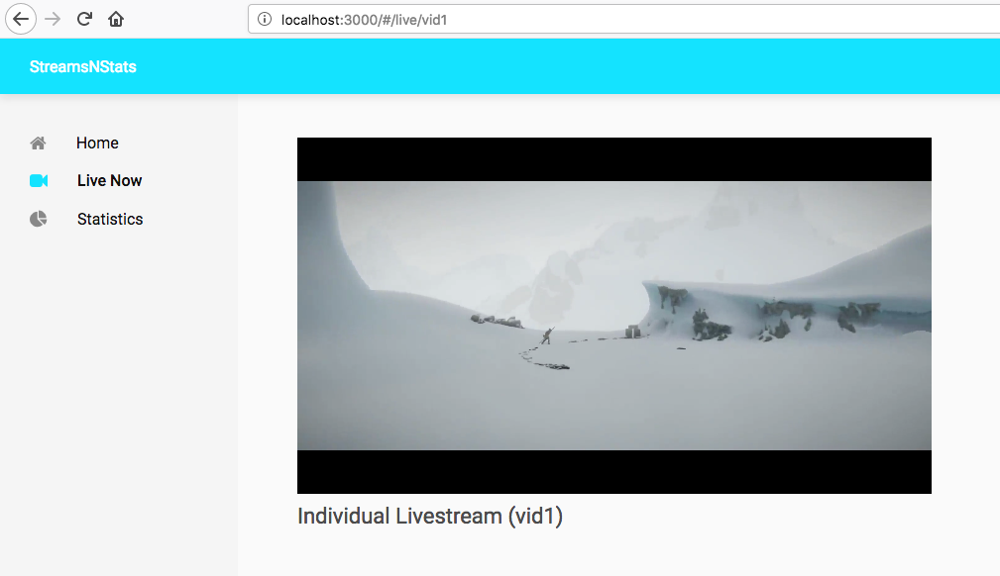

# SNS
Streams and Stats

## Logic

In this SPA there are 3 main pages: `Home`, `Live Now`, `Statistics` and one sub page `Single Video`

`Home` shows a Featured Livestream where ideally it would be chosen by people working in the backend.

`Live now` provides a list of livestreams that are currently providing content for people to watch.

`Statistics` lists some information about the streams in the form of charts.

And finally `Single Video` is a page that can be accessed by clicking on one of the videos' titles in `Live Now` page.
Where it shows the video scaled up in size.

## Code

The SPA's structure consists of two main folders:

1. `src/app`: the code directory.
2. `src/public`: the build directory.

The SPA is built with ReactJS framework, but has additional ES6 code for modularity purposes.

For the charts I used Chartistic.JS which seemed like it has the most straightforward API in terms of building simple Pie and Bars charts.

The JavaScript code is mostly written using the ES6 specifications, and Babel is used to compile it down to JavaScript that browsers understand.

The React and modules code resides in `src/app/`.
Although the style of the components is in `src/public/style/`.

Content of app consists of:
1. `components`: ReactJS components like Headers, Navigation bars, etc..
2. `pages`: Whole ReactJS pages built out of the previously mentioned components.
3. `util`: The above-mentioned modules coded especially to deal with repetition of code in the SPA.

The data used in both rendering livestreams and building charts resides in `src/public/assets/JSON`.

We use WebPack to bundle all the code into one file `bundle.js` that is later imported with a script tag into the web page.

## Try it out

To try the demo in this nodejs app:

1. Clone/Download this repo `git clone https://github.com/anefzaoui/sns`
2. Install the dependencies with `npm install` from within the directory
3. Make sure you have webpack installed globally, if not run `npm install -g webpack`
4. Run `npm start` which will run webpack, bundle the code altogether along with development version of react and run a local server to showcase the SPA.
5. Go to `http://localhost:3000`.

If you want the code to be minified and use production version of React instead of `npm start` you should run `npm run start:prod`.

## Screenshots

## Challenges

### Where's bootstrap?

There is no doubt that bootstrap makes it way easier to quickly build UIs and animations. But the absence of bootstrap comes from a personal belief that if we're not going to use a hefty amount of the bootstrap within our code, it shouldn't be added because it doesn't make sense to weighten up an SPA with unnecessary code if we're going to use it only once or twice.

So because we aim for SPAs to be as light as possible, bootstrap wasn't added for this app.

### Unresolved issues.

Despite the app functioning, there are still unsolved problems I couldn't get right in time. Which is where teamwork comes to consult with teammates about such difficulties.

All bugs/issues faced are in the Issues section of the git repo.

This includes: the video player used (Clappr) sometimes does not recognize the livestream source and there doesn't seem to be any debug information.

## What could be done better/ What can we add to make it better

- Some sort of history tracking for the user to go to a history tab and browse through what they watched since they started using the app.

- Testing. The SPA once decided it should go to production, it would definitely make use of functional, integration, and Unit tests.

- Debug mode for logs to be excluded from the bundled file once we decide to build for production.

## Why React (just for fun 🙂)?

For reference, people in the video are Twitter's @eveporcello @peggyrayzis @okbel @samerbuna @mxstbr @_jayphelps @ken_wheeler @iam_preethi
